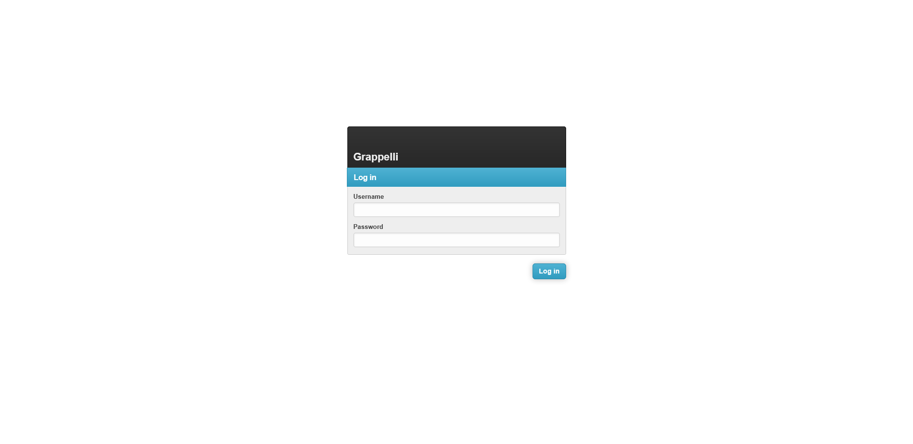
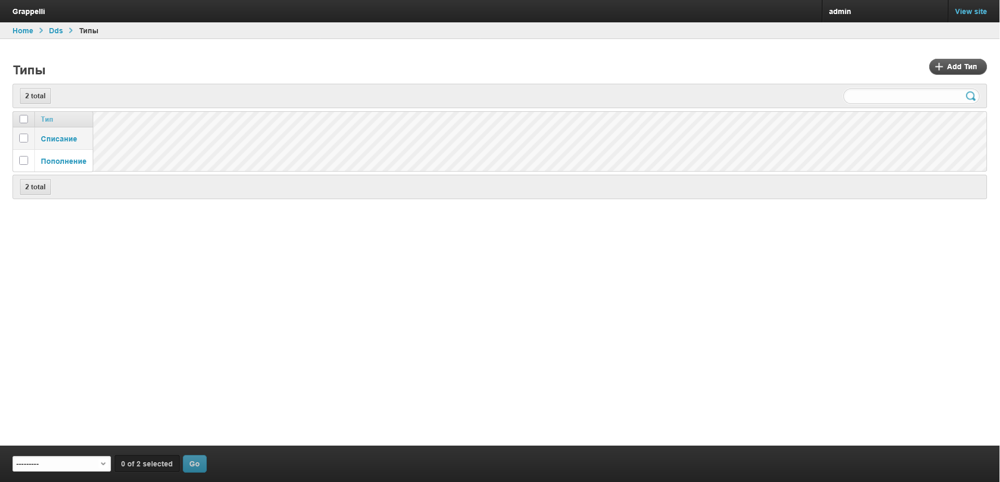
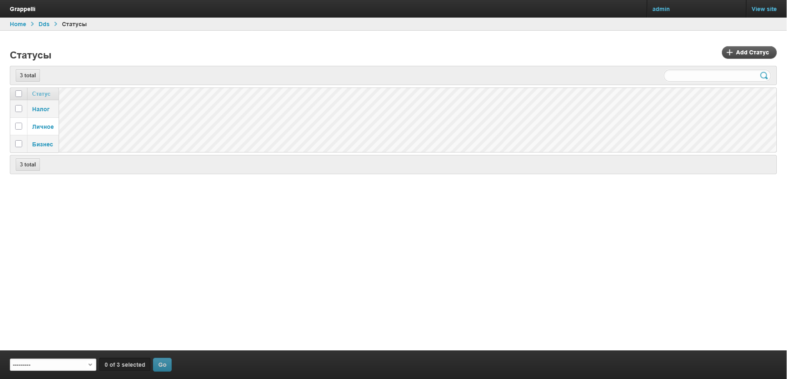
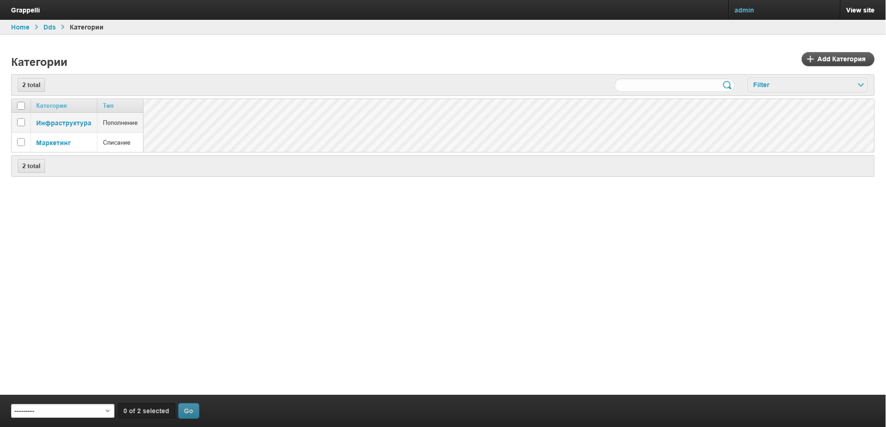
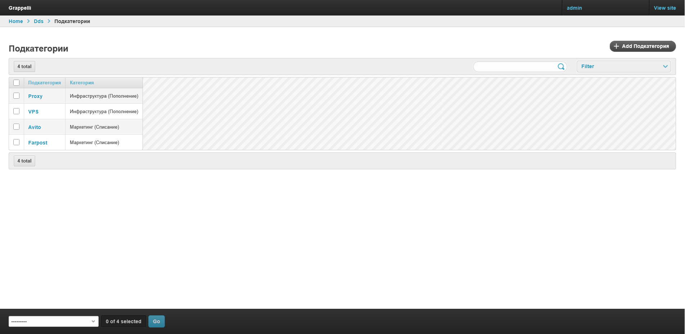
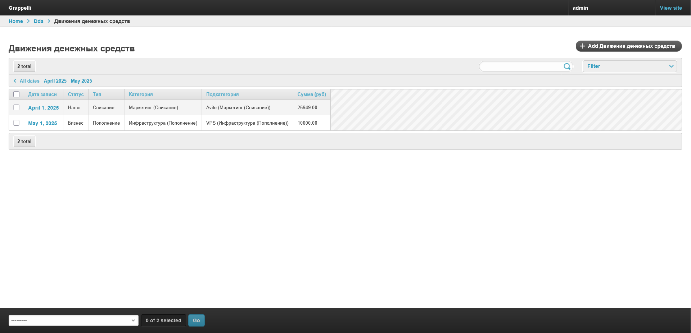
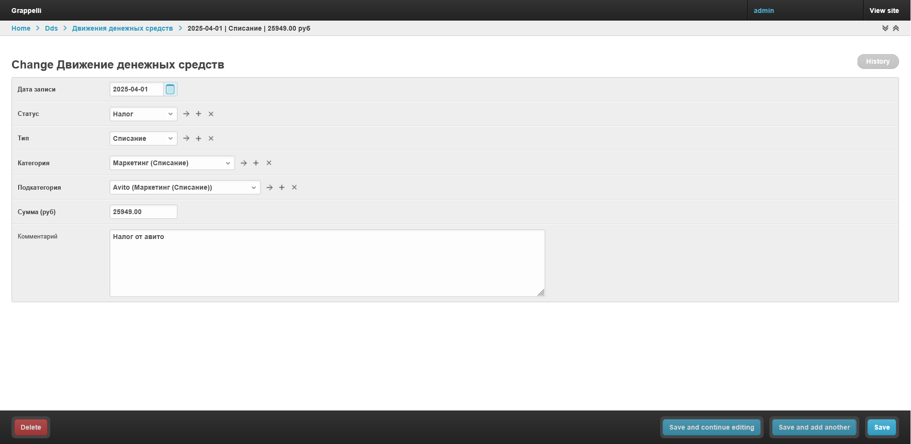
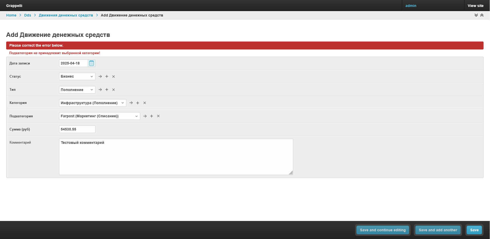
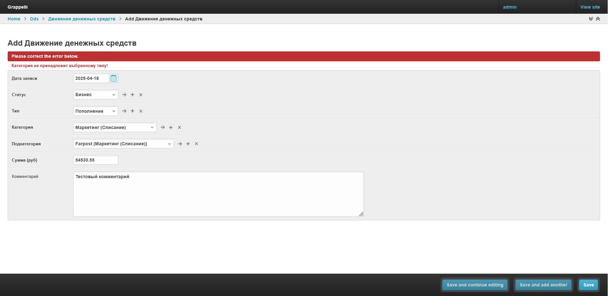

# Веб-сервис для управления движением денежных средств (ДДС)

Данный проект является тестовым заданием для IT-Solutions.

Веб-приложение для учета денежных операций с поддержкой фильтрации, справочников и валидации зависимостей.  
Используется Django и админ-панель с кастомизацией через `django-grappelli`.

---

## Установка

### Клонирование репозитория
```bash
git clone https://github.com/tr0ublekat/dds_testcase
cd dds_testcase
```

### Создание вирт. окружения
```bash
python -m venv venv
source venv/bin/activate  # Linux/MacOS
venv\Scripts\activate     # Windows
cd dds_service
```

### Установка зависимостей
```bash
pip install -r requirements.txt
```

---

## Настройка

###
Для простоты запуска:
- База данных sqlite3  с тестовыми данными уже вложена в репозиторий.
- Собрать статику - ```python manage.py collectstatic```

---

## Использование

### Запуск веб-сервера

```bash
python manage.py runserver
```

### Доступ
Админ панель - `http://localhost:8000/admin`.

Авторизация - `admin:admin`.

---

## Скриншоты










